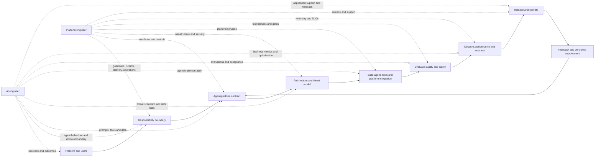

# Reusable Agent Pattern Development Guide

## Purpose

This guide defines how the Agentic AI platform team and AI application engineers should jointly develop, validate, and operate reusable agent patterns.

The reference implementation is `data-ai-genai-platform-agentic-gw-pattern`. The goal is to evolve it into a stable platform pattern that AI teams can adopt through configuration and supported extension points, without forking platform internals.

## Core development model

The pattern should separate platform capabilities from application behaviour:

```text
Platform layer
  identity, gateway, policy, networking, observability, deployment, quotas

Application layer
  agent instructions, domain tools, knowledge sources, workflows, evaluations
```

Platform engineers own the paved road and its guardrails. AI engineers own the agent experience and domain outcomes within those guardrails. Both teams jointly own the contract between them.

## Development lifecycle



## Touchpoint delivery matrix

The following matrix is the minimum working agreement. Inputs should be available before a touchpoint starts; outputs are the artefacts used by the next touchpoint. The listed deliverables are owned by the named role, with review from the other role.

| Touchpoint | Required inputs | Expected outputs | Platform engineer primarily delivers | AI engineer primarily delivers |
|---|---|---|---|---|
| Problem and user definition | User journey, business objective, constraints, affected systems | Use-case brief, success measures, out-of-scope actions, initial risk rating | Platform capability fit, known constraints, integration options | User scenarios, desired outcomes, domain constraints, unacceptable outcomes |
| Responsibility boundary | Use-case brief, platform catalogue, risk rating | Responsibility matrix, trust boundaries, human-approval points | Platform/application boundary, supported extension points, ownership model | Agent responsibilities, human hand-off rules, domain-owned components |
| Agent/platform contract | Responsibility matrix, interface needs, identity and data classification | Versioned schemas, configuration contract, error semantics, compatibility rules | Gateway/runtime interfaces, identity contract, policy hooks, deployment inputs/outputs | Prompt/context contract, tool schemas, knowledge requirements, expected responses |
| Architecture and threat model | Contract, data flows, dependencies, threat scenarios | Architecture decision record, threat model, mitigations, residual risks | Network, IAM, secrets, isolation, logging, model/tool trust boundaries | Prompt injection, data leakage, unsafe action, hallucination and misuse scenarios |
| Tool and action design | Approved actions, downstream APIs, authorisation model | Tool catalogue, schemas, permissions, idempotency and failure rules | Tool execution boundary, policy enforcement, audit events, timeouts and quotas | Tool purpose, input/output behaviour, selection guidance, domain validation |
| Implementation | Approved contract, architecture, test strategy | Deployable pattern and application, automated tests, configuration examples | Infrastructure modules, runtime integration, pipelines, guardrails and shared services | Prompts, workflows, tools, knowledge integration, application configuration |
| Evaluation and security testing | Test data, acceptance thresholds, threat model, reference scenarios | Evaluation results, security findings, regression baseline, remediation backlog | Infrastructure/security/contract test harness and quality gates | Golden datasets, task metrics, safety tests, groundedness and tool-use evaluation |
| Observability and operations | SLOs, support model, diagnostic needs, data-retention rules | Dashboards, alerts, logs, traces, runbooks, escalation paths | Common telemetry, correlation, dashboards, alerting, retention and access controls | Business metrics, diagnostic events, known failure modes, application runbook content |
| Performance, resilience and cost | Usage forecast, quotas, dependency limits, cost assumptions | Load results, latency/cost baseline, scaling rules, degraded-mode design | Capacity, throttling, retries, timeout controls, platform cost attribution | Context/model/tool optimisation, quality-cost trade-offs, fallback behaviour |
| Release and adoption | Approved version, test evidence, migration needs, support readiness | Release notes, deployment record, adopter guide, rollback plan | Promotion, approvals, versioning, compatibility and rollback mechanism | Application release, configuration migration, evaluation sign-off and adopter feedback |
| Operate and improve | Production telemetry, incidents, feedback, change requests | Health review, prioritised backlog, new version or deprecation decision | Platform health, incident response, dependency upgrades, lifecycle decisions | Quality trends, prompt/tool/data improvements, business outcome review |

### Touchpoint completion rule

Do not advance a touchpoint on verbal agreement alone. Store the output as a reviewable artefact in the repository or linked engineering record. A touchpoint is complete when:

- the required inputs are identified and current;
- both engineers agree the output is sufficient for the next activity;
- unresolved risks have an owner and due date;
- the change is covered by an appropriate automated or documented test.

## Responsibilities

### Platform engineer

The platform engineer provides the reusable capability and makes the safe path the easiest path.

Key responsibilities:

- Define the reference architecture, trust boundaries, supported deployment modes, and extension points.
- Provide reusable infrastructure and deployment composition for the gateway, agent runtime, tools, networking, identity, secrets, and supporting services.
- Establish secure defaults for IAM, encryption, network access, egress, data handling, logging, and tenant/environment isolation.
- Provide standard configuration contracts rather than requiring consumers to modify platform code.
- Own CI/CD quality gates, infrastructure validation, policy checks, promotion, rollback, and versioning.
- Provide common telemetry, correlation IDs, metrics, traces, dashboards, alerts, and operational runbooks.
- Define quotas, rate limits, concurrency controls, timeout/retry behaviour, and cost attribution.
- Maintain compatibility rules, release notes, migration guidance, deprecation policy, and support boundaries.
- Review application-specific extensions for security, operability, and maintainability.

### AI/application engineer

The AI engineer builds the agent solution using the platform contract and remains accountable for domain behaviour.

Key responsibilities:

- Define the user problem, agent role, expected outcomes, and unacceptable outcomes.
- Implement prompts/instructions, workflows, tool definitions, knowledge access, guardrails, and domain-specific policies.
- Keep application logic and domain tools outside shared platform internals.
- Define input/output schemas and validate model responses before taking actions.
- Classify data and identify sensitive information, retention requirements, and permitted model/tool access.
- Design for uncertainty: clarification, refusal, human escalation, confidence thresholds, and safe fallback.
- Build representative evaluation datasets covering normal, ambiguous, adversarial, and failure scenarios.
- Measure task success, factuality, groundedness, latency, cost, tool success, and unsafe behaviour.
- Provide application runbooks, known limitations, test evidence, and adoption feedback to the platform team.

## Development touchpoints

### 1. Problem and responsibility boundary

Before implementation, both engineers agree:

- What decision or task the agent supports.
- What the agent may and may not do.
- Which actions require human approval.
- Which components are platform-provided versus application-owned.
- What happens when the model, tool, knowledge source, or downstream system fails.

The output should be a short responsibility matrix and an initial threat model.

### 2. Agent and platform contract

Define the contract before building integrations:

- Request and response schemas.
- Authentication and caller identity.
- Tool registration and invocation model.
- Context and memory boundaries.
- Knowledge-source interfaces and grounding requirements.
- Error, timeout, retry, and refusal semantics.
- Logging and correlation fields.
- Configuration that consumers may set.
- Platform behaviour that consumers must not override.

The contract should be versioned and tested independently from implementation details.

### 3. Tool and action design

Every tool should have:

- A single, clearly described purpose.
- Strongly typed inputs and outputs.
- Explicit authorisation checks.
- Input validation and bounded parameters.
- Idempotency or duplicate-action protection where relevant.
- Timeout and retry rules.
- Audit events containing caller, agent, tool, target, decision, and outcome.
- A safe failure response that does not expose secrets or unnecessary internal details.

Platform engineers provide the tool execution boundary and policy hooks. AI engineers define the domain tool behaviour and test whether the agent selects and uses tools correctly.

### 4. Identity, security, and data handling

Platform engineers establish:

- Workload identity and least-privilege roles.
- Separation between platform, application, and end-user permissions.
- Secret storage and rotation.
- Network boundaries and controlled egress.
- Encryption and key ownership.
- Audit logging and access review.
- Environment and consumer isolation.

AI engineers provide:

- Data classification for prompts, context, memory, tools, and outputs.
- Rules for sensitive data redaction and minimisation.
- Approved data sources and model usage.
- Prompt-injection and indirect-instruction tests.
- Evidence that the agent cannot use a tool beyond its intended authority.

Security review must cover the complete chain: user → gateway → agent → model → tool → data/downstream system.

### 5. Evaluation and testing

Testing must combine software, infrastructure, and AI evaluation.

Platform-level tests should cover:

- Infrastructure deployment and drift detection.
- IAM and policy enforcement.
- Network and secret access boundaries.
- Schema and contract compatibility.
- Observability and alert generation.
- Rate limits, timeouts, retries, and failure recovery.

Application-level evaluations should cover:

- Task completion and business outcome quality.
- Factuality and grounding.
- Tool selection and argument correctness.
- Prompt injection, data leakage, and unsafe requests.
- Ambiguous requests and refusal behaviour.
- Regression across model, prompt, tool, and knowledge changes.

Evaluation datasets and acceptance thresholds must be versioned with the application.

### 6. Observability and operations

The platform should provide common telemetry so applications do not invent incompatible monitoring.

Minimum signals include:

- End-to-end correlation ID.
- Request volume, latency, errors, retries, and throttling.
- Model/provider, token usage, and estimated cost where available.
- Tool calls, duration, outcome, and failure category.
- Guardrail decisions, refusals, and human escalations.
- Dependency and downstream service health.

AI engineers define business-level success metrics and useful diagnostic context. Platform engineers turn those requirements into dashboards, alerts, retention rules, and support procedures without logging sensitive prompt or response content by default.

### 7. Performance, resilience, and cost

Before wider adoption, agree measurable targets for:

- Latency and throughput.
- Concurrency and quota behaviour.
- Availability and recovery expectations.
- Maximum tool execution duration.
- Model and token cost per successful task.
- Degraded-mode and provider-outage behaviour.

Platform engineers provide the controls and test harness. AI engineers optimise prompts, context size, model selection, tool sequencing, and workflow design against those constraints.

### 8. Delivery and change management

The delivery path should support independent but coordinated change:

- Platform releases are versioned and promoted through environments.
- Application configuration, prompts, tools, and evaluations are versioned separately where practical.
- Pull requests run infrastructure, security, contract, and AI evaluation gates.
- Breaking platform changes require a migration guide and compatibility window.
- Model, prompt, tool, and knowledge changes require regression evaluation.
- Production changes have an auditable approval and rollback path.

The shared deployment template should remain the standard entry point for infrastructure and environment promotion.

## Mandatory reusable-pattern capabilities

The pattern is not ready for broad reuse until it provides:

- A documented architecture and consumer contract.
- Parameterised deployment with no consumer-specific hard-coding.
- Secure identity, secrets, networking, and data-handling defaults.
- Standard tool registration and policy enforcement.
- Common logs, metrics, traces, dashboards, and alerts.
- Automated infrastructure, security, contract, and AI evaluation checks.
- Quotas, cost controls, timeout, retry, and failure-handling behaviour.
- A working reference application and at least one independent adopter or compatibility test.
- Upgrade, rollback, support, incident, and deprecation procedures.

## Reuse acceptance criteria

| Area | Required evidence |
|---|---|
| Contract | Versioned inputs, outputs, configuration, identity, and extension points |
| Security | Threat model, least-privilege review, data classification, negative security tests |
| Agent quality | Versioned evaluations with agreed quality and safety thresholds |
| Operations | Correlation, dashboards, alerts, runbooks, ownership, and escalation |
| Reliability | Timeout, retry, quota, dependency failure, and rollback tests |
| Delivery | Repeatable pipeline, automated gates, promotion, and release versioning |
| Cost | Usage baseline, attribution, limits, and optimisation approach |
| Adoption | Reference implementation plus independent reuse without a platform fork |

## Decision ownership

- Platform Engineering decides platform interfaces, supported infrastructure, security defaults, operational standards, and release policy.
- AI Engineering decides application prompts, domain workflows, tools, knowledge sources, evaluation datasets, and business acceptance.
- Security and Operations provide independent review and approval for their control areas.
- Tribe/product leadership endorses adoption when the acceptance evidence and ownership model are complete.

If an acceptance criterion is not met, the pattern should remain a controlled beta with an explicit limitation and remediation backlog rather than being presented as a broadly reusable platform capability.
