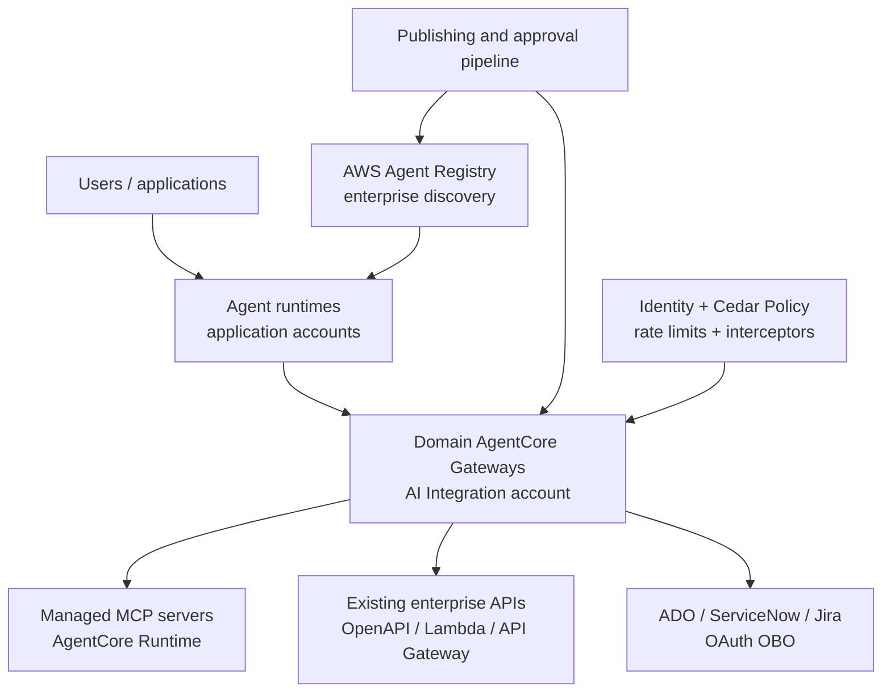
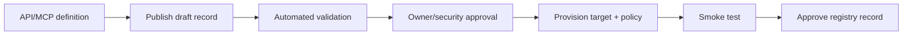

# Purpose
Refer to this implementation by Uber: https://www.uber.com/us/en/blog/designing-mcp-gateway/ 

Can you provide approach via aws agentcore-based?

# Response:
Yes. The closest AgentCore implementation would use a managed, federated gateway platform—not rebuild Uber’s entire MCP Gateway as a custom service.

The key design decision is:

> Use AWS Agent Registry as the enterprise discovery/control plane, multiple AgentCore Gateways as governed execution planes, and AgentCore Identity/Policy as the security boundary.

Avoid one organisation-wide gateway containing every tool. Partition gateways by domain and risk while keeping discovery centralized.

## Uber-to-AgentCore mapping

| Uber capability           | AWS AgentCore approach                               | Additional platform work                           |
| ------------------------- | ---------------------------------------------------- | -------------------------------------------------- |
| MCP Registry              | AWS Agent Registry                                   | Enterprise metadata and lifecycle standards        |
| Proxy Gateway             | AgentCore Gateway                                    | None for supported target types                    |
| APIs exposed as tools     | OpenAPI, Smithy and Lambda gateway targets           | Adapters for gRPC or proprietary protocols         |
| Native MCP discovery      | MCP target synchronization                           | Registration pipeline                              |
| AutoCrawler               | EventBridge + Step Functions/Lambda or pipeline      | Scan API catalog/repos and propose records         |
| Disabled-by-default tools | Registry draft/pending approval workflow             | Approval and deployment automation                 |
| Tool-level authorization  | AgentCore Policy using Cedar                         | Enterprise policy templates                        |
| Third-party identity      | AgentCore Identity OAuth/OBO                         | Entra app registrations and downstream consent     |
| Token/user propagation    | Entra JWT + OBO token exchange                       | Identity mapping and claims design                 |
| Sensitive-data redaction  | Gateway request/response interceptors                | Redaction/DLP Lambda implementation                |
| Rate limiting             | Native gateway rate limits                           | Per-agent/tool rate policy                         |
| Runtime tool discovery    | Gateway semantic tool search                         | Optional discovery broker for cross-gateway search |
| Omni MCP                  | Agent Registry MCP endpoint + small discovery broker | Dynamic connection/invocation logic                |
| Response Projection       | Response interceptor or integration adapter          | Custom implementation                              |
| Code Mode/aifx            | Internal CLI wrapping Registry and Gateway endpoints | CLI packaging and developer experience             |

AgentCore Gateway natively aggregates MCP targets, synchronizes their capabilities, converts OpenAPI/Lambda/Smithy interfaces into MCP tools, and can expose semantic tool search. ([Amazon Bedrock AgentCore][1])

AWS Agent Registry now provides the catalog capabilities that previously needed a custom registry: MCP servers, tools, agents and skills; draft/approval/deprecation lifecycle; hybrid search; custom metadata; and its own MCP discovery endpoint. ([Amazon Bedrock AgentCore][2])

## Recommended architecture

### 1. Central enterprise registry

Create separate non-production and production registries in the corresponding AI Integration accounts.

Each MCP record should carry at least:

* Owning tribe, squad and support group
* `airnz:ops:applicationid`
* Environment and lifecycle status
* MCP server or gateway endpoint
* Tool classification: `read`, `write`, `privileged`
* Data classification
* Human-delegated versus application identity
* Allowed consumer groups or agent identities
* Downstream OAuth audience and scopes
* Schema version and hash
* Rate and concurrency limits
* Operational SLO and contact
* Deprecation or replacement information

The Registry becomes the catalogue of approved capabilities. It should not be treated as the enforcement point or runtime proxy.

A timely implementation detail: AWS has moved Registry to the `agent-registry` namespace, and states that the preview `bedrock-agentcore` Registry namespace will be discontinued on 30 October 2026. New automation should use `agent-registry` immediately. ([Amazon Bedrock AgentCore][3])

### 2. Federated domain gateways

I would not create:

* One gateway per agent
* One gateway containing every enterprise tool

Instead, use gateways representing stable trust and operational boundaries, for example:

| Gateway             | Example tools                                 | Default posture                       |
| ------------------- | --------------------------------------------- | ------------------------------------- |
| Engineering Read    | Repository, pipeline and documentation search | Broadly available read access         |
| Engineering Change  | Branch creation, file update, PR creation     | User-delegated, tightly authorized    |
| Cloud Observability | CloudWatch, deployment and inventory queries  | Read-only, application/account scoped |
| ITSM Read           | ServiceNow request, CMDB and knowledge lookup | User/application scoped               |
| ITSM Change         | Create/update requests and change records     | User-delegated with audit controls    |
| Security Operations | Findings and approved response operations     | Dedicated high-trust boundary         |

This limits credential and policy blast radius while avoiding per-agent gateway proliferation.

AgentCore currently defaults to 100 targets per gateway and 1,000 tools per target, with account- and gateway-level invocation quotas. These are adjustable, but they are another reason to use domain gateways rather than a single “all tools” gateway. ([Amazon Bedrock AgentCore][4])

### 3. Authentication and identity flow

Use two distinct paths.

#### User-delegated operations

For operations such as creating an ADO branch, raising a PR or changing a ServiceNow record:

1. User authenticates with Entra ID.
2. The agent receives the user session identity.
3. AgentCore Gateway validates an audience-restricted JWT.
4. Cedar policy decides whether that user and agent may invoke the particular tool.
5. AgentCore Identity performs Entra OBO exchange.
6. The MCP server receives a short-lived, downstream-audience token.
7. The target authorizes the user and workload identity.

AgentCore now explicitly supports Microsoft’s OBO implementation using the JWT authorization grant pattern. It can exchange the inbound identity for a target-scoped token without another consent prompt. ([Amazon Bedrock AgentCore][5])

Where possible, use KMS-backed `private_key_jwt` client authentication instead of storing an Entra client secret. AgentCore Identity supports private-key JWT for outbound credential providers. ([Amazon Bedrock AgentCore][6])

Avoid simple bearer-token passthrough as the target state. AWS recommends OBO because passthrough reuses the same token across gateway and downstream audiences. ([Amazon Bedrock AgentCore][7])

#### Machine operations

For scheduled or autonomous read-only activity:

* Agent runtime assumes its application-specific IAM execution role.
* Cross-account resource policy permits that role to invoke only the relevant gateway.
* Gateway Cedar policy restricts the IAM principal to an approved target/tool set.
* Gateway uses SigV4, client credentials or a dedicated target identity downstream.

Do not let all runtimes call the gateway through one shared execution identity; that removes agent-level attribution and meaningful authorization.

### 4. Tool-level policy

Attach an AgentCore Policy engine to every production gateway.

Use Cedar to enforce combinations of:

* User or workload identity
* Entra group/role claims
* Agent identity
* Tool name
* Gateway target
* Tool input values
* Environment
* Application/account being accessed
* Read/write classification
* Session or approval state for sensitive operations

Policy is default-deny and forbid-overrides-permit. It can also filter `tools/list`, so an agent sees only tools it could potentially invoke. ([Amazon Bedrock AgentCore][8])

A useful rollout is:

1. Deploy policies in `LOG_ONLY`.
2. Compare expected and observed decisions.
3. Resolve false denials.
4. Move production gateways to `ENFORCE`.
5. Restrict `UpdateGateway`, because that permission can remove the policy engine or return it to log-only mode. ([Amazon Bedrock AgentCore Control Plane][9])

### 5. Registration and enablement workflow

Reproduce Uber’s strongest governance principle: discovery does not equal exposure. Uber discovers APIs automatically but leaves tools disabled until their owning service team reviews and enables them. ([uber.com][10])

For AgentCore:

The validation stage should check:

* Valid MCP/OpenAPI schema
* Unique and meaningful tool names
* Clear descriptions
* Owner and application ID
* Read/write classification
* Authentication mode
* No embedded credentials
* Response-size constraints
* Required Cedar policy
* Rate-limit configuration
* Network reachability
* Logging and audit configuration

Use the Registry’s EventBridge events to trigger the existing ADO approval/deployment pipeline. AWS supports integrating Registry approval with an external review pipeline and updating record status programmatically. ([Amazon Bedrock AgentCore][11])

### 6. Cross-gateway discovery

AgentCore Gateway semantic search solves discovery within a gateway. AWS Agent Registry solves discovery across registered gateways, MCP servers, agents and skills.

For most business agents, use a curated set of one or two gateways. Do not give every agent dynamic access to the full registry.

For Codex Engineering Assistant, build a small discovery broker resembling Uber’s Omni MCP:

* `search_capabilities(query)`
* `get_capability(record_id)`
* `get_tool_schema(server, tool)`
* `invoke_approved_tool(server, tool, arguments)`

Internally it would:

1. Search the Agent Registry MCP endpoint.
2. Return only approved records visible to the caller.
3. Resolve the relevant domain gateway.
4. Obtain a gateway-scoped token.
5. Invoke the tool through the gateway.
6. Preserve user, agent, session and request identity in audit records.

This broker should not possess universal downstream credentials. It performs discovery and routing; AgentCore Gateway and target-specific identity remain the enforcement boundaries.

### 7. Existing API onboarding

Uber’s important insight is that enterprises should expose existing APIs as tools instead of making every team build native MCP servers. ([uber.com][10])

Apply that as follows:

* REST API with OpenAPI: direct Gateway OpenAPI target
* AWS Lambda operation: Lambda target
* AWS service/custom modeled operation: Smithy target
* Existing MCP server: MCP server target with synchronization
* Complex integration/business logic: MCP server on AgentCore Runtime
* gRPC/proprietary protocol: thin adapter on Runtime, Lambda or API Gateway
* External SaaS: central MCP server in the AI Integration account using AgentCore Identity

Private enterprise targets can remain in their owning application accounts and be reached through controlled VPC Lattice/PrivateLink patterns rather than moving the service into the integration account.

### 8. Security and observability

Use the Gateway as the common enforcement and telemetry point:

* Cedar authorization on every tool call
* Per-caller, per-target and per-tool rate limits
* Request interceptor for validation and contextual controls
* Response interceptor for redaction and projection
* CloudWatch logs, metrics and traces
* CloudTrail for control-plane operations
* Correlation fields: user, agent, application ID, session, request, tool, target and authorization decision

Gateway interceptors can implement request validation, custom authorization, response filtering and transformation, but each gateway supports only one request and one response interceptor. Therefore, build each as a reusable policy chain rather than separate Lambdas per requirement. ([Amazon Bedrock AgentCore][12])

## Delivery sequence

I would implement this in four increments:

1. Foundation: production/non-production Registry, two domain gateways, Entra/IAM inbound identity, Cedar default-deny, standard logging and tagging.
2. Integration: ADO and CloudWatch MCP servers, one read gateway and one controlled-write gateway, OBO for user actions.
3. Productization: ADO onboarding template that publishes Registry records, provisions targets/policies/rate limits, tests and promotes them.
4. Enterprise discovery: Registry-backed discovery broker and internal CLI for Codex and other broad engineering assistants.

The architectural position I would take is:

> AgentCore provides enough managed capability to implement Uber’s gateway model without building a central custom proxy and registry from scratch. Our engineering investment should focus on the enterprise publishing workflow, identity propagation, tool policy, metadata quality and developer experience. Use one governed Registry, several domain/risk-aligned Gateways, and centrally operated sensitive integration identities.

This also reinforces your proposed AI Integration account: application accounts own reasoning runtimes, while the integration account owns enterprise discovery, gateways, integration MCP servers, policy and downstream credential exchange.

[1]: https://docs.aws.amazon.com/bedrock-agentcore/latest/devguide/gateway-core-concepts.html?utm_source=chatgpt.com "Core concepts for Amazon Bedrock AgentCore Gateway"
[2]: https://docs.aws.amazon.com/bedrock-agentcore/latest/devguide/registry.html?utm_source=chatgpt.com "AWS Agent Registry: Discover and manage agents, tools, and resources"
[3]: https://docs.aws.amazon.com/bedrock-agentcore/latest/devguide/registry-create-manage.html?utm_source=chatgpt.com "Create and manage registries"
[4]: https://docs.aws.amazon.com/bedrock-agentcore/latest/devguide/bedrock-agentcore-limits.html?utm_source=chatgpt.com "Quotas for Amazon Bedrock AgentCore"
[5]: https://docs.aws.amazon.com/bedrock-agentcore/latest/devguide/on-behalf-of-token-exchange.html?utm_source=chatgpt.com "On-behalf-of token exchange with AgentCore Identity"
[6]: https://docs.aws.amazon.com/bedrock-agentcore/latest/devguide/resource-providers.html?utm_source=chatgpt.com "Configure credential provider"
[7]: https://docs.aws.amazon.com/bedrock-agentcore/latest/devguide/gateway-inbound-auth.html?utm_source=chatgpt.com "Set up inbound authorization for your gateway"
[8]: https://docs.aws.amazon.com/bedrock-agentcore/latest/devguide/policy-understanding-cedar.html?utm_source=chatgpt.com "Understanding Cedar policies"
[9]: https://docs.aws.amazon.com/bedrock-agentcore-control/latest/APIReference/API_GatewayPolicyEngineConfiguration.html?utm_source=chatgpt.com "GatewayPolicyEngineConfiguration"
[10]: https://www.uber.com/re/en/blog/designing-mcp-gateway/?utm_source=chatgpt.com "Designing MCP Gateway Uber's MCP Management Platform"
[11]: https://docs.aws.amazon.com/bedrock-agentcore/latest/devguide/registry-key-capabilities.html?utm_source=chatgpt.com "Key capabilities"
[12]: https://docs.aws.amazon.com/bedrock-agentcore/latest/devguide/gateway-interceptors.html?utm_source=chatgpt.com "Using interceptors with Gateway"
